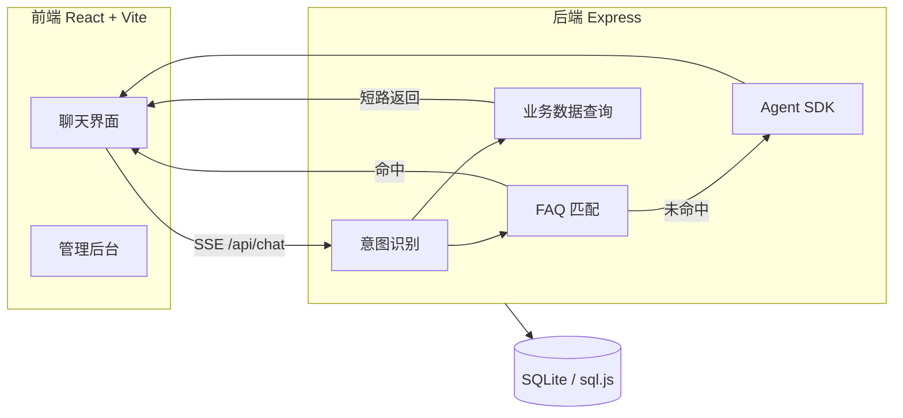

# Smart CS Agent · 智能客服

[](LICENSE)
[](https://nodejs.org/)
[](https://react.dev/)
[](https://www.typescriptlang.org/)

基于 **CodeBuddy Agent SDK** 构建的全栈 AI 智能客服系统。支持意图识别、FAQ 知识库、订单/退款业务查询、流式对话与人工转接，开箱即用的电商客服 Demo。

---

## ✨ 功能亮点

| 模块 | 说明 |
|------|------|
| 💬 **流式对话** | SSE 实时推送 AI 回复，支持 Markdown 渲染 |
| 🎯 **意图识别** | 自动分类：退款 / 订单查询 / 技术支持 / 一般咨询 |
| 📚 **FAQ 知识库** | 40+ 条预设问答，关键词匹配 + 个性化数据注入 |
| 📦 **业务数据集成** | 订单、退款、用户记忆等 SQLite 持久化 |
| 🤖 **Agent SDK 兜底** | FAQ 未命中时调用 AI，携带用户上下文 |
| 👤 **人工转接** | 关键词 / 轮次 / 情绪启发式触发转人工 |
| ⭐ **满意度评价** | 会话结束后 1–5 星评分 |
| 📊 **管理后台** | 会话统计、意图分布、满意度概览 |
| 🎨 **高级感 UI** | 玻璃拟态 + 渐变动效，深色/浅色主题 |
| 🔧 **自定义 Agent** | 多角色客服配置，独立 System Prompt |

---

## 🏗 架构概览



**消息处理流水线：**

1. **意图检测** — 根据关键词将用户消息分类
2. **转人工判断** — 满足条件则标记 `transfer_to_human`
3. **业务短路** — 订单/退款意图 + 用户 ID 时直接查库返回
4. **FAQ 检索** — 按意图 + 关键词评分匹配预设答案
5. **AI 兜底** — 调用 `@tencent-ai/agent-sdk`，注入用户订单、VIP 等级、跨会话记忆

---

## 🛠 技术栈

| 层级 | 技术 |
|------|------|
| 前端 | React 18 · TypeScript · Vite · Tailwind CSS |
| UI 组件 | TDesign React · @tdesign-react/chat · Lucide Icons |
| 后端 | Node.js · Express · TypeScript (tsx) |
| AI | [@tencent-ai/agent-sdk](https://www.npmjs.com/package/@tencent-ai/agent-sdk) |
| 数据库 | SQLite via [sql.js](https://sql.js.org/)（WASM，无原生依赖） |
| 通信 | Server-Sent Events (SSE) 流式响应 |

---

## 🚀 快速开始

### 环境要求

- **Node.js** 18+
- **npm** 或 yarn

### 1. 克隆仓库

```bash
git clone https://github.com/voidcard/smart-cs-agent.git
cd smart-cs-agent
```

### 2. 安装依赖

```bash
npm install
```

### 3. 配置环境变量

复制示例文件并填入 API Key：

```bash
cp .env.example .env
```

```env
# 必填：从 https://www.codebuddy.cn 获取
CODEBUDDY_API_KEY=your_api_key_here

# 可选
PORT=3000
# CODEBUDDY_AUTH_TOKEN=
# CODEBUDDY_BASE_URL=
# CODEBUDDY_INTERNET_ENVIRONMENT=external
```

> 也可使用 CodeBuddy CLI 登录：`codebuddy login`，应用会自动读取 CLI 凭证。

### 4. 启动开发服务器

```bash
npm run dev
```

| 服务 | 地址 |
|------|------|
| 前端 (Vite) | http://localhost:5173 |
| 后端 (Express) | http://localhost:3000 |

首次启动会自动创建 `data/chat.db` 并写入测试用户 **test**（VIP2）、6 条订单与 2 条退款记录。

---

## 📁 项目结构

```
smart-cs-agent/
├── server/
│   ├── index.ts          # Express 路由、SSE 聊天、Agent SDK 集成
│   ├── db.ts             # SQLite  schema、CRUD、种子数据
│   ├── faq.ts            # FAQ 知识库（~40 条，4 大分类）
│   └── textUtils.ts      # 文本编码校验、会话标题修复
├── src/
│   ├── pages/ChatPage.tsx
│   ├── components/       # 聊天 UI、侧边栏、管理后台等
│   ├── hooks/            # useChat、useSessions、useUser …
│   ├── premium-ui.css    # 高级感 UI 样式与动效
│   └── config.ts         # 应用名称、意图配置
├── data/                 # SQLite 数据库（gitignore，运行时生成）
├── .env.example
├── DEVELOPMENT.md        # 二次开发指南
└── CLAUDE.md             # AI 辅助开发说明
```

---

## 💡 使用说明

### 快捷咨询

欢迎页提供 **服务主题卡片** 与 **热门问题**，点击即可发起对应意图的对话。

### 测试账号

登录后可体验个性化回复（订单、VIP 等级等会注入 AI 上下文）：

| 字段 | 值 |
|------|-----|
| 手机号 | 任意 11 位（首次自动注册） |
| 测试用户 | 舒珺琦 · VIP2 |

### 管理后台

访问 `/admin` 查看会话量、意图分布、平均满意度等统计。

### 自定义 Agent

在 **设置页** (`/settings`) 创建专属客服角色，配置名称、图标、颜色与 System Prompt。

---

## 📡 API 概览

<details>
<summary><b>点击展开完整 API 列表</b></summary>

### 健康 & 认证

| 方法 | 路径 | 说明 |
|------|------|------|
| GET | `/api/health` | 健康检查 |
| GET | `/api/check-login` | 检查 CodeBuddy 登录状态 |
| POST | `/api/auth/register` | 用户注册 |
| POST | `/api/auth/login` | 用户登录 |
| GET | `/api/auth/me` | 当前用户信息 |

### 会话 & 聊天

| 方法 | 路径 | 说明 |
|------|------|------|
| GET/POST | `/api/sessions` | 列表 / 创建会话 |
| GET/PATCH/DELETE | `/api/sessions/:id` | 查询 / 更新 / 删除 |
| POST | `/api/chat` | 发送消息（**SSE 流式**） |
| POST | `/api/permission-response` | 工具权限确认 |
| POST | `/api/sessions/:id/rate` | 满意度评分 |

### 业务数据

| 方法 | 路径 | 说明 |
|------|------|------|
| GET | `/api/orders/:userId` | 用户订单列表 |
| GET | `/api/orders/:orderId/detail` | 订单详情 |
| GET/POST | `/api/refunds/:userId` | 退款记录 / 申请 |
| GET/POST | `/api/memory/:userId` | 跨会话用户记忆 |

### FAQ & 管理

| 方法 | 路径 | 说明 |
|------|------|------|
| GET | `/api/faq/categories` | FAQ 分类 |
| GET | `/api/faq/list` | FAQ 列表 |
| POST | `/api/faq/search` | FAQ 搜索 |
| GET | `/api/admin/stats` | 管理统计 |
| GET | `/api/admin/sessions` | 会话明细 |

</details>

### SSE 事件类型

| 事件 | 含义 |
|------|------|
| `init` | 会话初始化 |
| `text` | 流式文本片段 |
| `tool` / `tool_result` | 工具调用 |
| `permission_request` | 权限确认 |
| `intent_detected` | 意图识别结果 |
| `transfer_to_human` | 转人工 |
| `done` | 响应完成 |
| `error` | 错误信息 |

---

## ⚙️ 开发命令

```bash
npm run dev          # 同时启动前后端
npm run dev:server   # 仅后端 (:3000)
npm run dev:client   # 仅前端 (:5173)
npm run build        # TypeScript 检查 + Vite 生产构建
npm run preview      # 预览构建产物
npm run server       # 运行生产后端
```

生产部署建议：先 `npm run build`，再由 Express 托管 `dist/` 静态资源，或前后端分开部署。

---

## 🔧 配置说明

### 权限模式

内置四种工具调用权限策略（默认 `bypassPermissions`，面向终端用户隐藏选择器）：

| 模式 | 行为 |
|------|------|
| `default` | 每次工具调用需确认 |
| `acceptEdits` | 自动接受编辑类操作 |
| `plan` | 只读计划模式 |
| `bypassPermissions` | 跳过所有权限检查 |

### 数据库表

`sessions` · `messages` · `satisfaction_ratings` · `users` · `orders` · `refunds` · `user_memory`

---

## 📖 二次开发

如需定制 FAQ、扩展业务 API、修改聊天流水线，请参阅 [**DEVELOPMENT.md**](./DEVELOPMENT.md)。

---

## 🤝 贡献

欢迎提交 Issue 与 Pull Request。开发前请先阅读 `DEVELOPMENT.md` 了解架构细节。

---

## 📄 License

[MIT](./LICENSE)

---

<p align="center">
  <sub>Built with CodeBuddy Agent SDK · React · Express</sub>
</p>
